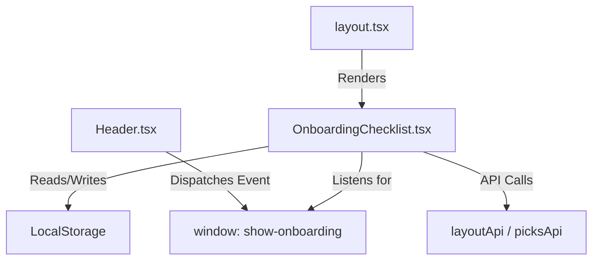

# User Onboarding Flow - Implementation Plan

## Goal

Guide new users through their first 10 minutes with an optional, persistent Onboarding Checklist. Users can skip it and restart it later from the profile menu.

---

## Architecture Overview



---

## Components

### 1. OnboardingChecklist Component (NEW)

**File:** `frontend/components/OnboardingChecklist.tsx`

#### State Management

```typescript
interface OnboardingStep {
  id: 'design' | 'upload' | 'dashboard';
  label: string;
  description: string;
  href: string;
  completed: boolean;
}

const [isVisible, setIsVisible] = useState(true);
const [isMinimized, setIsMinimized] = useState(false);
const [steps, setSteps] = useState<OnboardingStep[]>([...]);
const [loading, setLoading] = useState(true);
```

#### Initialization Logic

```typescript
useEffect(() => {
  // Check if user has dismissed onboarding
  const skipped = localStorage.getItem('onboarding_skipped') === 'true';
  if (skipped) {
    setIsVisible(false);
    return;
  }

  // Fetch completion status from APIs
  const checkProgress = async () => {
    const layouts = await layoutApi.getLayouts();
    const hasElements = layouts.some(l => l.element_count > 0); // Step 1

    let hasPickData = false;
    if (layouts.length > 0) {
      const dates = await picksApi.getDates(layouts[0].id);
      hasPickData = dates.length > 0; // Step 2
    }

    // Step 3: Check if user has visited dashboard (localStorage flag)
    const visitedDashboard = localStorage.getItem('onboarding_dashboard_visited') === 'true';

    setSteps(prev => prev.map(step => ({
      ...step,
      completed: step.id === 'design' ? hasElements :
                 step.id === 'upload' ? hasPickData :
                 step.id === 'dashboard' ? visitedDashboard : false
    })));
    setLoading(false);
  };
  checkProgress();
}, []);
```

#### Skip Handler

```typescript
const handleSkip = () => {
  localStorage.setItem('onboarding_skipped', 'true');
  setIsVisible(false);
};
```

#### Restart Listener

```typescript
useEffect(() => {
  const handleShowOnboarding = () => {
    localStorage.removeItem('onboarding_skipped');
    setIsVisible(true);
  };
  window.addEventListener('show-onboarding', handleShowOnboarding);
  return () => window.removeEventListener('show-onboarding', handleShowOnboarding);
}, []);
```

#### UI Structure

```tsx
{isVisible && (
  <div className="fixed bottom-6 right-6 z-50 ...">
    {isMinimized ? (
      <button onClick={() => setIsMinimized(false)}>
        📋 Getting Started ({completedCount}/{totalCount})
      </button>
    ) : (
      <div className="bg-slate-900 rounded-xl border ...">
        <header>
          <h3>Getting Started</h3>
          <button onClick={() => setIsMinimized(true)}>−</button>
          <button onClick={handleSkip}>×</button>
        </header>
        <ProgressBar value={completedCount / totalCount} />
        <ul>
          {steps.map(step => (
            <li key={step.id}>
              <Link href={step.href}>
                <Checkbox checked={step.completed} />
                <span>{step.label}</span>
              </Link>
            </li>
          ))}
        </ul>
      </div>
    )}
  </div>
)}
```

---

### 2. Header Modification

**File:** `frontend/components/Header.tsx`

Add menu item to restart onboarding in the profile dropdown:

```tsx
// Inside the profile dropdown menu
<button
  onClick={() => {
    window.dispatchEvent(new CustomEvent('show-onboarding'));
    setIsProfileOpen(false);
  }}
  className="block px-4 py-2 text-sm text-slate-300 hover:bg-slate-800 hover:text-white transition-colors"
>
  Show Onboarding Guide
</button>
```

---

### 3. Layout Integration

**File:** `frontend/app/layout.tsx`

```tsx
import OnboardingChecklist from '@/components/OnboardingChecklist';

export default function RootLayout({ children }) {
  return (
    <html lang="en">
      <body className={...}>
        {children}
        <OnboardingChecklist />
      </body>
    </html>
  );
}
```

---

### 4. Dashboard Visit Tracking

**File:** `frontend/app/dashboard/page.tsx`

Add effect to mark dashboard as visited:

```typescript
useEffect(() => {
  if (hasData) {
    localStorage.setItem('onboarding_dashboard_visited', 'true');
  }
}, [hasData]);
```

---

## LocalStorage Keys

| Key | Type | Description |
|-----|------|-------------|
| `onboarding_skipped` | `'true' \| null` | Set when user clicks "Skip" |
| `onboarding_dashboard_visited` | `'true' \| null` | Set when user views dashboard with data |

---

## Onboarding Steps

| Step | Label | Description | Completion Check |
|------|-------|-------------|------------------|
| 1 | Design Your Layout | Create warehouse elements | `layoutApi.getLayouts()` → any layout has elements |
| 2 | Upload Pick Data | Import your CSV data | `picksApi.getDates(layoutId)` → has dates |
| 3 | View Analytics | Check your dashboard | `localStorage.onboarding_dashboard_visited` |

---

## Verification Plan

| Step | Action | Expected Result |
|------|--------|-----------------|
| 1 | Fresh user opens app | Checklist visible, 0/3 complete |
| 2 | Click "Skip" | Checklist hides |
| 3 | Refresh page | Checklist stays hidden |
| 4 | Profile → "Show Guide" | Checklist reappears |
| 5 | Add elements in Designer | Step 1 marked complete |
| 6 | Upload CSV data | Step 2 marked complete |
| 7 | Visit Dashboard with data | Step 3 marked complete |
